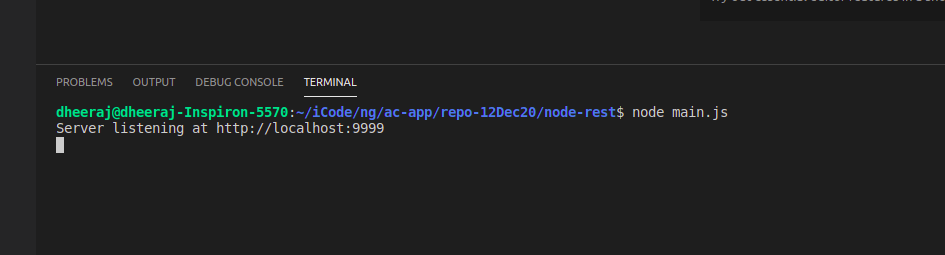

# repo-12Dec20
.net 5 angular project -- update the backend with nodeJs & expressjs

## Backend - .Net Core port-5000/1 
## Backend -  node js port 9999

## frontend - angular

# create solution
**> dotnet new sln --name ac-repo**


### dotnet new webapi --name ac.api
### dotnet new xunit --name ac.test

# add projects to sln
### >_ dotnet sln ac-repo.sln add ./ac.api/ac.api.csproj ./ac.test/ac.test.csproj

### >_ dotnet sln ac-repo.sln list
```
Project(s)
----------
ac.api/ac.api.csproj
ac.test/ac.test.csproj
```
### trust cert for the first time
dotnet dev-certs https --trust

# run the code
```
Terminal:
1- run ng app
      ac.ngweb/my-app$ npm start
2-run node:
      node-rest$ node main.js
```
# Screenshot
## 1


## 2 check api without login token


## 3 login


## 4 add token


## 5 add token 2


## 6 ng start


## 7 home page 


## 8 login page


## 9 landing page


